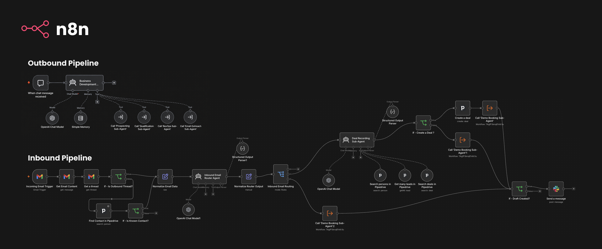
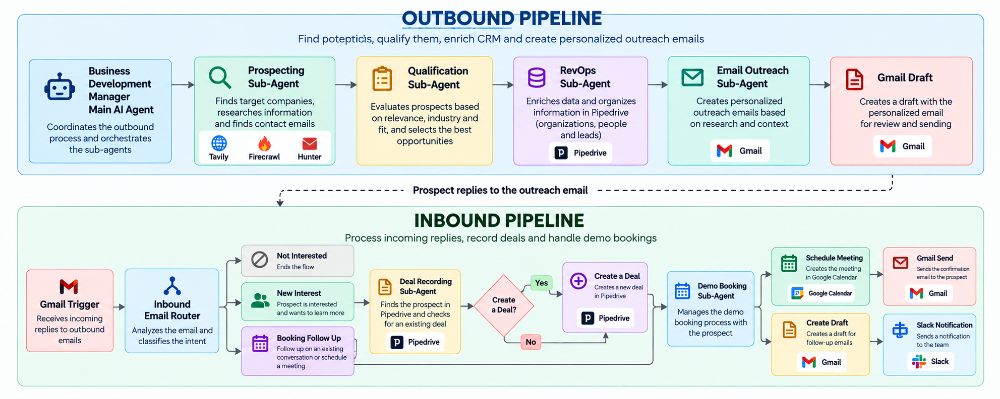

# AI Outbound Sales Automation - n8n

An **n8n-based multi-agent** sales automation system designed to support the full outbound sales lifecycle — from discovering and qualifying prospects to CRM registration, personalized outreach, inbound reply handling, and demo scheduling.

## Overview



The project is intentionally split into **two complementary workflow systems**:

1. **Outbound Prospecting & Outreach** — finds companies and contacts, qualifies them, registers them in the CRM, and prepares personalized outreach drafts in email.
2. **Inbound Reply & Demo Booking** — monitors incoming email replies, determines what stage of the conversation the prospect is in, updates the CRM when appropriate by creating new deals, and handles demo scheduling.

The second system was introduced after the initial outbound pipeline so that the automation could continue working after an email had been sent.

The system treats sales automation as a set of specialized agents instead of one large agent responsible for everything.

Each agent has a narrow responsibility and a well-defined input/output contract. The main workflow coordinates the agents, while external systems are integrated either through dedicated agent tools or workflow nodes.

The core principle is:

> **Use an agent for reasoning and a workflow node/tool for deterministic actions.**

For example:

- The Qualification Agent decides whether a prospect matches the requested criteria.
- Pipedrive nodes perform deterministic CRM operations.
- Google Calendar performs the actual availability check and event creation.

## Table of Contents

- [Architecture](#architecture)
- [System 1 — Outbound Pipeline](#system-1--outbound-pipeline)
  - [Business Development Manager](#business-development-manager)
  - [Prospecting Sub-Agent](#prospecting-sub-agent)
  - [Qualification Sub-Agent](#qualification-sub-agent)
  - [RevOps Sub-Agent](#revops-sub-agent)
  - [Email Outreach Sub-Agent](#email-outreach-sub-agent)
- [System 2 — Inbound Pipeline](#system-2--inbound-pipeline)
  - [Inbound Email Router](#inbound-email-router)
  - [Deal Recording Sub-Agent](#deal-recording-sub-agent)
  - [Demo Booking Sub-Agent](#demo-booking-sub-agent)
- [End-to-End Flows](#end-to-end-flows)
  - [Outbound Flow](#outbound-flow)
  - [Inbound New Interest Flow](#inbound-new-interest-flow)
  - [Inbound Booking Follow-Up Flow](#inbound-booking-follow-up-flow)
- [Why the Inbound Router Exists](#why-the-inbound-router-exists)
- [Data Contracts](#data-contracts)
- [Tools and Integrations](#tools-and-integrations)
- [AI Models](#ai-models)
- [Token and Workflow Optimization](#token-and-workflow-optimization)
- [Project Evolution](#project-evolution)
- [Repository Structure](#repository-structure)
- [Configuration](#configuration)
- [Security and Public Workflow Files](#security-and-public-workflow-files)
- [Known Limitations](#known-limitations)
- [Development Notes](#development-notes)
- [Target Audience](#target-audience)
- [Repository](#repository)
- [Author](#author)
- [Final Note](#final-note)

---

# Architecture

## High-level architecture



---

# System 1 — Outbound Pipeline

The outbound pipeline is responsible for finding potential customers, qualifying them, managing CRM records, and preparing the initial outreach.

The pipeline is intentionally sequential:

```text
User Request
    ↓
Business Development Manager
    ↓
Prospecting
    ↓
Qualification
    ↓
RevOps / Pipedrive
    ↓
Email Outreach
    ↓
Gmail Draft
```

The outbound system does **not automatically send the initial emails**. The Email Outreach Agent creates Gmail drafts so they can be reviewed before sending.

---

## Business Development Manager

The Business Development Manager is the orchestration layer.

It receives the user's sales objective through the n8n chat trigger and delegates specialized tasks to the appropriate sub-agents.

### Responsibilities

- Understand the user's prospecting objective.
- Preserve the user's criteria throughout the process.
- Call Prospecting first.
- Call Qualification after Prospecting.
- Call RevOps after Qualification.
- Only invoke Email Outreach when sufficient sales context exists.
- Pass complete agent outputs between stages.
- Avoid performing specialized work itself when a dedicated agent exists.

### Main outbound sequence

```text
1. Prospecting Sub-Agent
2. Qualification Sub-Agent
3. RevOps Sub-Agent
4. Email Outreach Sub-Agent (when sales context is available)
```

The main workflow uses a memory node and workflow-tool calls to coordinate the sub-agents.

---

## Prospecting Sub-Agent

The Prospecting Agent is responsible for **discovering companies and relevant professional contacts**.

### Input

The complete original prospecting request, including criteria such as:

- number of prospects;
- country;
- industry;
- location;
- company type;
- business model;
- company size;
- target market;
- other user-defined constraints.

### Tools

The workflow uses MCP-connected research tools:

- **Tavily** — initial prospect discovery/search.
- **Firecrawl** — website/company validation and research.
- **Hunter** — contact discovery and email verification.

### Processing strategy

The agent is designed to avoid excessive tool usage:

1. Find candidate companies with search.
2. Validate promising companies.
3. Find one relevant professional contact.
4. Verify the email when possible.
5. Stop when enough valid prospects have been processed.

The workflow explicitly avoids repeatedly searching the same company or using one tool to compensate for information that another tool should provide.

The agent does not invent missing contact or company information.

---

## Qualification Sub-Agent

The Qualification Agent evaluates the prospects returned by Prospecting.

### Input

- original user request;
- complete prospecting result.

### Responsibilities

- Evaluate every prospect against all requested criteria.
- Check company fit.
- Check contact relevance.
- Check data quality.
- Preserve the original prospect data.
- Do not perform new prospecting.
- Do not use external tools.

### Qualification model

Each prospect receives:

- `high` — 80–100
- `medium` — 50–79
- `low` — 0–49

The structured result includes a score and a concise factual reason.

Example:

```json
{
  "company_name": "Example Company",
  "contact_name": "Jane Doe",
  "email": "jane@example.com",
  "qualification": "high",
  "score": 92,
  "reason": "Matches the requested industry and company profile with a relevant decision-maker."
}
```

---

## RevOps Sub-Agent

The RevOps Agent turns qualified prospects into structured CRM records in **Pipedrive**.

### Processing logic

For each qualified prospect:

```text
Search Organization
      ↓
Create Organization if needed
      ↓
Search Person
      ↓
Create Person if needed
      ↓
Get/Search Lead
      ↓
Create Lead when required
```

The workflow uses the IDs returned by Pipedrive when associating records.

### Duplicate protection

The agent is designed to reuse existing:

- organizations;
- people;
- leads.

This prevents the outbound pipeline from creating duplicate CRM records when the prospect already exists.

---

## Email Outreach Sub-Agent

The Email Outreach Agent is responsible for creating **personalized outbound email drafts** after prospects have been qualified and registered in the CRM.

### Required sales context

The workflow requires the user to explicitly provide enough information about:

- the product or service;
- the value proposition/message;
- the campaign objective.

The agent must not invent missing sales information.

### Processing

```text
CRM Records
     ↓
Retrieve relevant Pipedrive context when needed
     ↓
Personalize each message
     ↓
Create Gmail Draft
```

### Safety rules

- Never send emails automatically.
- Never invent product claims.
- Never invent customers, pricing, results, features, or achievements.
- Never create a draft without a valid recipient email.
- Avoid duplicate drafts during a single execution.

The result is a Gmail draft ready for human review.

---

# System 2 — Inbound Pipeline

The inbound pipeline handles incoming prospect replies, deal recording, and demo booking.

It starts with:

```text
Gmail Message Received
```

and handles the prospect's reply.

The inbound system is intentionally separate from the outbound prospecting workflow because it has a different trigger, different data, and different responsibilities.

---

## Inbound Email Router

The Inbound Email Router is the first AI decision point in the inbound workflow.

Its purpose is **routing**, not CRM work.

It classifies the incoming conversation into exactly one of three paths:

```text
not_interested
new_interest
booking_follow_up
```

### `not_interested`

Examples include:

- clear rejection;
- unsubscribe requests;
- requests to stop contact;
- automatic/out-of-office replies;
- messages without genuine commercial interest.

The workflow ends without CRM or booking actions.

### `new_interest`

The prospect has clearly expressed commercial interest, but the conversation has not yet entered an active meeting-booking exchange.

This path goes through:

```text
Deal Recording
    ↓
Create Deal if needed
    ↓
Demo Booking
```

### `booking_follow_up`

The conversation is already in a meeting-booking exchange.

Examples:

- confirming a proposed slot;
- selecting one of the suggested options;
- changing a previously proposed time;
- discussing the date/time of the demo.

This path skips the Pipedrive lookup stage and goes directly to Demo Booking.

---

## Why the Inbound Router Exists

The router was introduced to solve an important architectural problem in the original inbound design.

Originally, the Deal Recording Agent was responsible for both:

1. deciding whether a prospect was interested;
2. performing CRM lookups.

That meant a message such as:

> "The first option works for me."

could unnecessarily trigger:

```text
Search Person in Pipedrive
Search Lead in Pipedrive
Search Deal in Pipedrive
```

before reaching the booking workflow.

The refactored architecture separates responsibilities:

```text
Inbound Email Router
        ↓
      routing
        ↓
 ┌──────┴─────────┐
new interest   booking follow-up
      ↓                ↓
Deal Recording    Demo Booking
```

This reduces unnecessary tool calls and keeps each agent focused on one job.

---

## Deal Recording Sub-Agent

The Deal Recording Agent now assumes that the inbound router has already determined that the prospect is commercially interested.

Its responsibility is CRM lookup and duplicate protection.

### Processing

```text
Sender Email
    ↓
Search Person
    ↓
Get Person's Lead
    ↓
Identify Organization
    ↓
Search Existing Deal
    ↓
Return CRM result
```

### If the person is not found

The agent returns null CRM identifiers and stops the lookup chain rather than guessing.

### If an existing deal is found

The workflow does **not** create another deal.

### If no deal exists

The downstream `If - Create a Deal?` node allows the workflow to create one.

```text
person_id != null
AND
lead_id != null
AND
existing_deal == null
```

Only when all three conditions are satisfied is the Create Deal node executed.

---

## Demo Booking Sub-Agent

The Demo Booking Agent handles the actual meeting conversation.

It works with:

- the current prospect email;
- the previous thread;
- prospect contact details;
- company information;
- the Gmail thread ID.

### Main outcomes

There are three important booking states:

```text
scheduled
awaiting_confirmation
unavailable
```

### Case 1 — Prospect expresses interest without choosing a time

Example:

> "Yes, I'm interested. I'd like to see a demo."

The agent must:

1. not create a meeting;
2. check calendar availability;
3. find up to three available future 30-minute slots;
4. create a Gmail draft in the existing thread;
5. ask the prospect which slot works best.

Result:

```text
scheduled = false
status = awaiting_confirmation
```

### Case 2 — Prospect proposes a specific time

Example:

> "Could we do Thursday at 15:00?"

The agent:

1. resolves the requested date/time in Europe/Lisbon;
2. checks the exact 30-minute slot;
3. schedules it if available;
4. otherwise searches for alternatives and creates a draft reply.

### Case 3 — Prospect confirms a previously proposed slot

Example:

> "The first option works for me."

The current email must explicitly confirm the slot. The previous thread is used only to determine which proposed option the prospect means.

If the slot is available:

```text
Google Calendar Availability
        ↓
Create Calendar Event
        ↓
Google Meet conference data
        ↓
Gmail confirmation email
```

### Case 4 — Requested time is unavailable

The agent:

- does not create the meeting;
- searches for alternatives;
- proposes available future slots;
- creates the reply as a Gmail draft in the existing thread.

Result:

```text
scheduled = false
status = unavailable
```

---

# End-to-End Flows

## Outbound Flow

```text
User
 ↓
Chat Trigger
 ↓
Business Development Manager
 ↓
Prospecting
 ├─ Tavily
 ├─ Firecrawl
 └─ Hunter
 ↓
Qualification
 ↓
RevOps
 └─ Pipedrive
 ↓
Email Outreach
 ├─ Pipedrive lookup when needed
 └─ Gmail draft
```

The human remains in control of the final initial email send.

---

## Inbound New Interest Flow

Example:

> "Yes, I'm interested. I'd like to see a demo."

```text
Gmail Trigger
 ↓
Get Email Content
 ↓
Get Thread
 ↓
Normalize Email
 ↓
Inbound Email Router
 ↓
new_interest
 ↓
Deal Recording
 ├─ Search Person
 ├─ Get Lead
 └─ Search Deal
 ↓
Create Deal?
 ├─ YES → Create Deal
 └─ NO
        ↓
Demo Booking
 ↓
Calendar Availability
 ↓
Gmail Draft
 ↓
Slack Notification
```

If the prospect has already expressed a meeting time and that time is explicitly confirmed in the current message, the Demo Booking workflow can instead proceed toward scheduling.

---

## Inbound Booking Follow-Up Flow

Example:

> "The first option works for me."

```text
Gmail Trigger
 ↓
Get Email Content
 ↓
Get Thread
 ↓
Normalize Email
 ↓
Inbound Email Router
 ↓
booking_follow_up
 ↓
Demo Booking
 ↓
Calendar Availability
 ↓
┌─────────────────────────┐
│                         │
▼                         ▼
Available              Unavailable
│                         │
Create Event              Find alternatives
│                         │
Google Meet               Gmail Draft
│                         │
Gmail Send                Slack
│
Scheduled
```

The important optimization is that **no Pipedrive lookup is required on this branch**.

---

# Data Contracts

The system uses structured outputs between agents so each stage has a predictable contract.

---

# Tools and Integrations

| System              | Purpose                                          |
| ------------------- | ------------------------------------------------ |
| **n8n**             | Workflow orchestration and agent execution       |
| **OpenAI models**   | Reasoning and structured agent outputs           |
| **Tavily**          | Prospect discovery/search                        |
| **Firecrawl**       | Company website validation/research              |
| **Hunter**          | Contact discovery and email verification         |
| **Pipedrive**       | Organizations, persons, leads, and deals         |
| **Gmail**           | Email retrieval, drafts, and confirmations       |
| **Google Calendar** | Availability checks and event creation           |
| **Google Meet**     | Meeting conferencing through Calendar event data |
| **Slack**           | Human operational notifications                  |

The prospecting workflow uses **MCP-connected** research tools, while CRM, email, calendar, and Slack actions are exposed through dedicated n8n nodes/tools.

---

# AI Models

The current workflows use different models for different types of tasks.

The exact model choice is intentionally task-specific:

| Agent                        | Current configuration | Purpose                              |
| ---------------------------- | --------------------- | ------------------------------------ |
| Business Development Manager | GPT-5 family          | Orchestration                        |
| Prospecting                  | GPT-5.6 Terra         | Research/tool reasoning              |
| Qualification                | GPT-5.6 Terra         | Structured evaluation                |
| RevOps                       | GPT-5 family          | CRM decision-making                  |
| Email Outreach               | GPT-5.6 Luna          | Personalized drafting                |
| Inbound Email Router         | GPT-5 Mini            | Lightweight classification           |
| Demo Booking                 | GPT-5 Mini            | Booking reasoning/tool orchestration |

Low reasoning is used for lightweight routing/drafting tasks, while more reasoning is used where research or qualification requires deeper evaluation.

---

# Token and Workflow Optimization

One of the main engineering goals of the project is to avoid unnecessary agent/tool calls.

### Original inbound problem

The Deal Recording Agent could be called for every interested reply, including meeting-booking follow-ups. That caused unnecessary Pipedrive searches.

### Refactored solution

A dedicated routing layer now determines the conversation state before CRM work happens:

```text
               Inbound Email Router
                       │
        ┌──────────────┼──────────────┐
        │              │              │
        ▼              ▼              ▼
 not_interested   new_interest   booking_follow_up
                       │              │
                       ▼              ▼
                 Deal Recording   Demo Booking
```

This trades one lightweight classification call for the ability to skip unnecessary Pipedrive operations on booking follow-ups.

The prospecting workflow follows the same principle by explicitly limiting repeated searches and stopping once enough valid prospects have been processed.

---

# Project Evolution

The project evolved in stages rather than being built as a single workflow.

## Phase 1 — Outbound Sales Pipeline

The first architecture focused on:

```text
Prospecting
↓
Qualification
↓
RevOps
↓
Email Outreach
```

This solved the initial prospect discovery and outreach problem.

## Phase 2 — Deal Recording

The next step added inbound email monitoring and CRM handling for positive replies.

The Deal Recording Agent was responsible for identifying interested prospects and checking the CRM before creating deals.

## Phase 3 — Demo Booking

Demo Booking was added to move from “interested” to an actual meeting workflow:

```text
Interest
↓
Calendar Availability
↓
Draft / Confirmation
↓
Calendar Event
↓
Meet + Email Confirmation
```

## Phase 4 — Inbound Routing Refactor

The final major architectural change introduced the Inbound Email Router.

Instead of sending every interesting email through the CRM flow, the router distinguishes:

- no commercial interest;
- new commercial interest;
- ongoing meeting-booking conversation.

This keeps the Deal Recording Agent focused on CRM work and allows booking follow-ups to bypass Pipedrive.

---

# Repository Structure

A practical repository structure for the exported workflows is:

```text
.
├── README.md
│
├── workflows/
│   ├── main/
│   │   └── Business Development Manager AI Main Workflow.json
│   │
│   ├── outbound/
│   │   ├── Prospecting Sub-Agent.json
│   │   ├── Qualification Sub-Agent.json
│   │   ├── RevOps Sub-Agent.json
│   │   └── Email Outreach Sub-Agent.json
│   │
│   └── inbound/
│       ├── Deal Recording Sub-Agent.json
│       └── Demo Booking Sub-Agent.json
│
```

The exact filenames can vary depending on how the n8n exports are organized.

---

# Configuration

Before importing the public workflow exports into a private n8n environment, configure the required integrations and placeholders.

Typical configuration includes:

### n8n

- self-hosted n8n instance;
- required LangChain/n8n nodes;
- workflow imports;
- activation of the workflows that should run automatically.

### OpenAI

Configure the OpenAI credential used by the AI model nodes.

### Pipedrive

Configure a Pipedrive credential with access to the required CRM resources:

- organizations;
- persons;
- leads;
- deals.

### Gmail

Configure Gmail OAuth access for:

- reading messages;
- reading threads;
- creating drafts;
- sending confirmation emails when required.

### Google Calendar

Configure calendar access for:

- free/busy availability checks;
- event creation;
- attendee invitations;
- conference data / Google Meet.

### Slack

Configure the Slack credential and target channel used for draft notifications.

### Research services

Configure the MCP integrations required by the Prospecting Agent:

- Tavily;
- Firecrawl;
- Hunter.

---

# Security and Public Workflow Files

The repository is intended to contain **sanitized workflow exports**, not private production configuration.

Public workflow files should never contain:

- API keys;
- access tokens;
- OAuth secrets;
- passwords;
- private credential IDs;
- personal email addresses;
- private Slack channel IDs;
- private workflow IDs;
- webhook IDs tied to a private instance;
- n8n instance identifiers.

Use placeholders such as:

```text
YOUR_OUTBOUND_EMAIL@example.com
YOUR_DEMO_BOOKING_WORKFLOW_ID
YOUR_SLACK_CHANNEL_ID
```

Credentials should be configured after importing the workflow into the user's own n8n instance.

---

# Known Limitations

## Replies outside the original email thread

The current routing system can distinguish whether a conversation thread contains an outbound message and can attempt to identify a known Pipedrive contact when it does not.

However, if a prospect starts a completely new email thread instead of replying to the original thread, the workflow may not have the complete historical conversation context needed to identify a booking follow-up such as:

> “The first option works for me.”

This is an identified area for future refinement.

## Human review remains intentional

The current system deliberately keeps human intervention in the initial outreach and in booking drafts that require confirmation.

The automation handles research, classification, CRM operations, availability checks, and scheduling logic, but it is not intended to remove human oversight from every communication step.

---

# Development Notes

This project intentionally uses a **multi-agent architecture rather than one monolithic AI workflow**.

The central design decisions are:

1. **Specialized responsibilities** — each agent performs one class of task.
2. **Structured outputs** — downstream nodes receive predictable data contracts.
3. **Deterministic tools for actions** — CRM, calendar, email, and Slack operations are performed by workflow tools/nodes.
4. **Routing before expensive operations** — the inbound router prevents unnecessary CRM calls.
5. **Human-in-the-loop communication** — outbound emails start as drafts and booking drafts can be reviewed before sending.
6. **Duplicate protection** — CRM and booking flows contain explicit safeguards against repeated creation.

## Target Audience

This project is primarily aimed at technical teams interested in building AI-powered sales automation systems using n8n and multi-agent workflows.

It may be particularly useful for:

- Teams looking to automate outbound sales and lead qualification
- Developers interested in combining LLMs with deterministic workflow automation
- Technical users working with tools such as n8n, Pipedrive, Gmail, and Google Calendar
- Anyone interested in building human-in-the-loop AI systems for business processes

# Repository

GitHub:

https://github.com/andref218/ai_outbound_sales_automation

---

# Author

**André Fonseca**

- GitHub: https://github.com/andref218

---

## Final Note

This project is a practical exploration of building an AI-powered sales workflow with multiple specialized agents and deterministic workflow automation. The architecture is designed to keep each agent focused on a specific responsibility while maintaining human oversight where it matters, particularly during initial outreach and meeting-booking confirmations.

The system is still evolving, but the current implementation provides a solid foundation for automating prospecting, qualification, CRM management, outreach, inbound email handling, and demo booking while keeping important actions controlled and reviewable.
